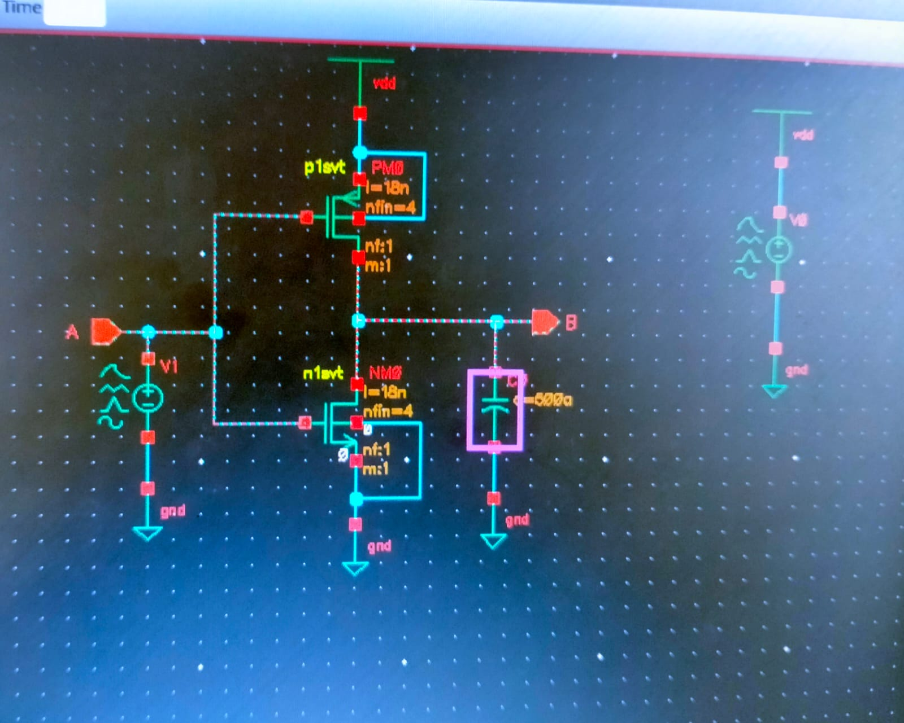
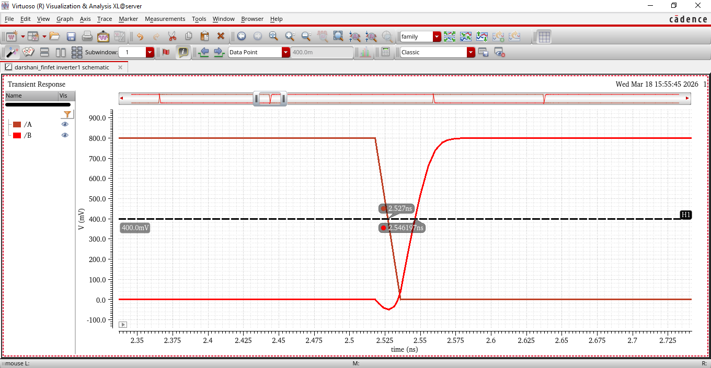
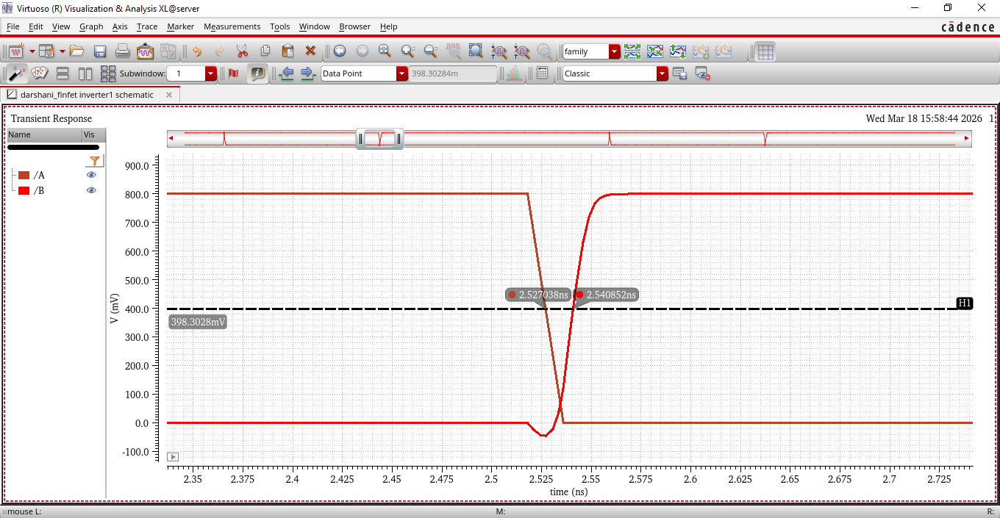
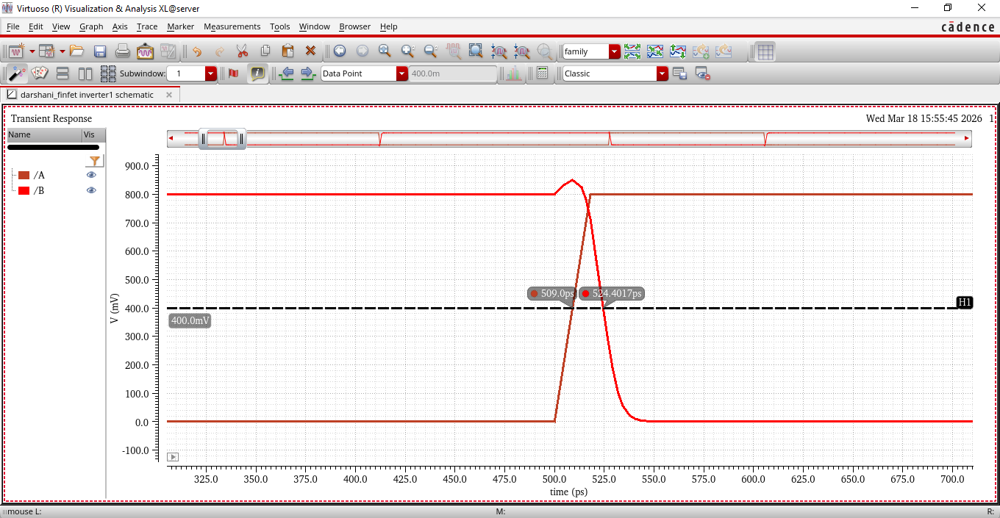
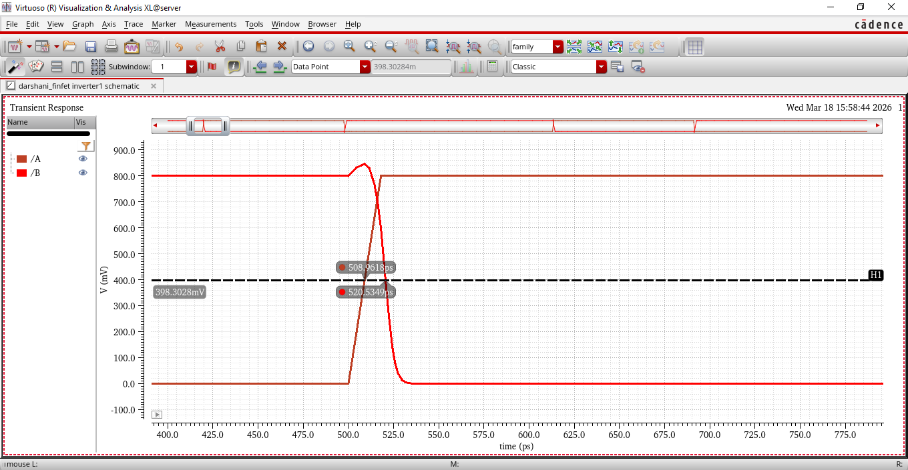
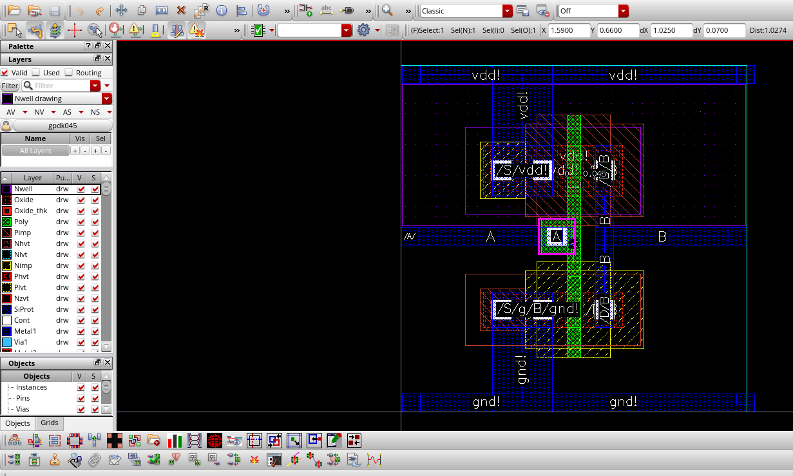
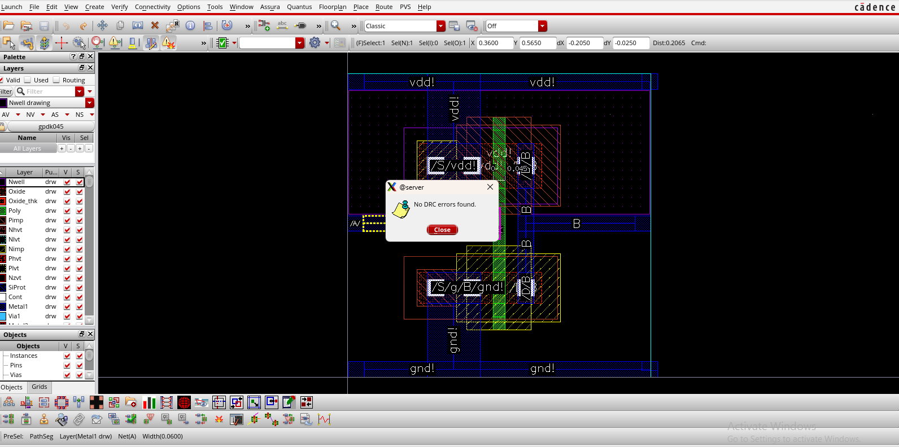
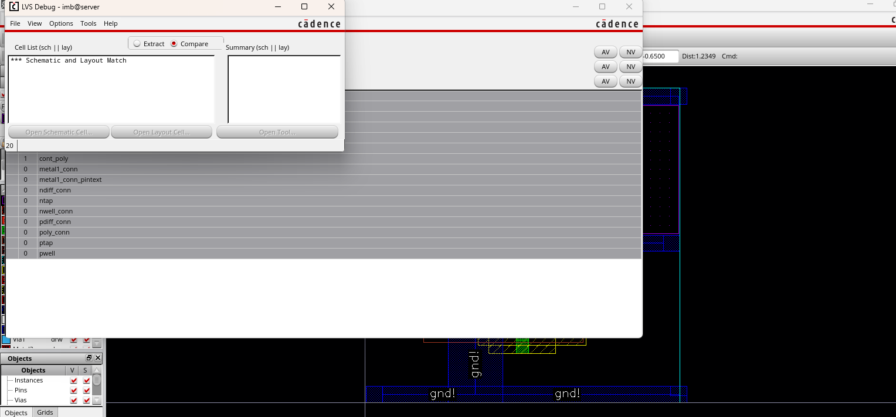

# 🔷 FinFET Inverter Design and Analysis

## 📌 Overview
This project presents the design and analysis of a FinFET-based inverter. 
A comparison is performed between:
- 2-Fin vs 4-Fin configurations
- Conventional 45nm CMOS vs FinFET technology

## ⚙️ Tools Used
- Cadence Virtuoso

## ⚡ Circuit Schematic

The inverter is implemented using FinFET PMOS and NMOS transistors.

## 📊 Transient Analysis
The output waveform confirms correct inverter operation:
- Input HIGH → Output LOW  
- Input LOW → Output HIGH  

## ⬆️ Rise Time Analysis

### 2-Fin

### 4-Fin

---

## ⬇️ Fall Time Analysis

### 2-Fin

### 4-Fin

---

## 📊 Performance Comparison

| Design | Rise Time | Fall Time  |
|--------|-----------|------------|
| 2-Fin  | 19.0 ps   | 15.40 ps   |
| 4-Fin  | 13.0 ps   | 11.57 ps   |

---
## 📈 Propagation Delay Observation

- 2-fin inverter shows propagation delay of 3.6 ps  
- 4-fin inverter shows propagation delay of 1.43 ps  

Increasing the number of fins improves drive strength, resulting in faster charging/discharging of the load capacitance and reduced propagation delay.

## 🧩 Layout Design

---

## ✅ DRC Verification

No design rule violations found.

---

## 🔗 LVS Verification

Layout matches schematic successfully.

## 📈 Key Observations
- Increasing number of fins improves current driving capability
- FinFET provides better performance than planar CMOS at scaled nodes

## 🧠 Concepts Covered
- Short Channel Effects in nanoscale devices  
- FinFET structure and electrostatic control  
- Impact of fin count on drive strength  
- Switching delay and transient response analysis  

## 🚀 Conclusion
FinFET technology offers superior performance in terms of speed and scalability compared to traditional CMOS technology.

## 👩‍💻 Author
Darshani
